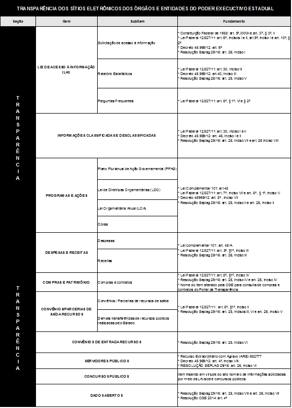

# INTRODUÇÃO

Este guia tem como objetivo auxiliar os órgãos e entidades do Poder Executivo Estadual na implementação do Menu *Transparência*, conforme previsto no art. 8º, inc. VI do Decreto nº 45.969/2012.

A Lei Federal nº 12.527, de 18 de novembro 2011, conhecida como Lei de Acesso à Informação (LAI), que regula o acesso a informações previsto na Constituição Federal de 1988, estabelece no art. 8º que ***"É dever dos órgãos e entidades públicas promover, independentemente de requerimentos, a divulgação em local de fácil acesso, no âmbito de suas competências, de informações de interesse coletivo ou geral por eles produzidas ou custodiadas".***

No âmbito estadual, a transparência ativa foi regulamentada por meio do Decreto nº 45.969, de 24 de maio de 2012. O capítulo II do Decreto, que é dedicado à transparência ativa, determina a divulgação espontânea (independente de requerimento) de informações de interesse coletivo ou geral, produzidas ou custodiadas pelos órgãos e entidades do Poder Executivo Estadual de Minas Gerais, e define parâmetros a serem adotados no Portal da Transparência do Estado e nos sítios institucionais dos órgãos e entidades.

A Resolução SEPLAG nº 29/2016 estabelece as diretrizes para a estruturação, a elaboração, a manutenção e a administração de sítios eletrônicos de informação de serviços públicos dos órgãos e entidades do Poder Executivo Estadual. No que tange à transparência, ela detalha os requisitos mínimos que devem ser atendidos pelos órgãos e entidades, incluindo a especificação de quais informações devem constar no botão *Transparência* dos sítios institucionais.

Assim, a intenção deste Guia de Publicação do menu *Transparência* dos sites oficiais do Poder Executivo do Estado de Minas Gerais é oferecer ao cidadão um padrão que facilite a navegação em todos os sítios eletrônicos, permitindo uma rápida localização e obtenção das informações desejadas.

Além disso, a divulgação espontânea do maior número possível de informações, além de facilitar o acesso, também é vantajosa porque tende a reduzir as demandas sobre o assunto nos canais de transparência passiva, minimizando o trabalho e os custos de processamento e gerenciamento dos pedidos de acesso.

Tendo em vista as exigências previstas nas normas supramencionadas, reforça-se a importância de os órgãos e entidades revisarem e incrementarem o conteúdo do menu *Transparência* de seus sítios eletrônicos. A Controladoria-Geral do Estado (CGE), por meio da Superintendência Central de Transparência Ativa, coloca-se à disposição para esclarecer dúvidas sobre as regras e diretrizes definidas neste guia.

# ORGANIZAÇÃO DOS CONTEÚDOS

A divulgação de dados e informações de forma espontânea relativas à Lei de Acesso à Informação deve ser feita em seção específica denominada *Transparência*, e disponibilizada na **página inicial** dos sítios institucionais dos órgãos e entidades.

A nomenclatura e a disposição dos itens do menu **Transparência** devem seguir a estrutura abaixo :

- Serviço de Acesso à Informação

-	Informações Classificadas e Desclassificadas

- Perguntas Frequentes

-	Ações e Programas

-	Receitas e Despesas

-	Compras e Contratos

- Obras Públicas

-	Convênios, Repasses e Transferências

- Doações, Comodatos e Cooperações

-	Pessoal

-	Concursos Públicos

-	Dados Abertos

- Participação Social

Os órgãos e entidades deverão seguir a estrutura estabelecida para o menu ***Transparência***, com o objetivo de criar um local único e padronizado que concentre as informações mínimas e necessárias de modo a facilitar a localização da informação pelo cidadão.

Todos os itens obrigatórios devem ser criados, ainda que não haja conteúdo a ser divulgado. Nesse caso, deve-se criar o item e nele informar, de maneira explícita, que não há, até o momento, conteúdo a ser publicado.

Serão apresentados para cada seção do menu:
- Objetivos
- Impactos desejados
- Legislação
- Frequência de atualização
- Texto Padrão

Este guia deve ser utilizado junto com o ***checklist*** a ser disponibilizado pela Controladoria Geral do Estado, por meio da Subcontroladoria de Transparência e Integridade.

# DIRETRIZES PARA DISPONIBILIZAÇÃO DOS CONTEÚDOS

Todos os itens constantes do menu *Transparência*  deverão conter um texto explicativo. As sugestões de textos apresentadas poderão ser utilizadas pelos órgãos e entidades que assim desejarem.

## Sobre a Lei de Acesso à Informação

**a)	Textos explicativos:** deverão ser inseridos textos introdutórios sobre a Lei de Acesso à Informação e orientações sobre os encaminhamentos de pedidos de acesso à informação para os órgãos e entidades, seguidos dos respectivos links.

Sugestão:

- *A Lei de Acesso à Informação (Lei 12.527/11) regulamenta o direito constitucional de acesso às informações públicas, sendo aplicável aos três Poderes da União, dos Estados, do Distrito Federal e dos Municípios.*

- *Em Minas Gerais, os pedidos de informação são feitos por meio do Sistema Eletrônico de Acesso à Informação - e-SIC, que permite a elaboração e o acompanhamento dos pedidos e recursos.*

*Para maiores informações sobre a Lei de Acesso à Informação e sua regulamentação no âmbito do Estado de Minas Gerais, acesse o Portal da Transparência.* <http://www.transparencia.mg.gov.br/>

*Para realizar sua solicitação de acesso à informação, acesse o E-SIC.*
<http://www.transparencia.mg.gov.br/acessoainformacao>

**b) Relatórios dos pedidso de acesso à informação:** Deverá ser inserido link para que o cidadão acesse os relatórios de pedidos de acesso à informação elaborados pela Controladoria Geral do Estado (CGE).

Sugestão:

- *Acesse os relatórios estatísticos com a quantidade de pedidos de acesso à informação recebidos, atendidos e indeferidos.* (http://www.transparencia.mg.gov.br/o-que-e#relatórios-gerenciais-–-lei-de-acesso-à-informação)

**c) Dúvidas:** Divulgar na página inicial as perguntas que os cidadãos mais constumam fazer por meio do Fale Conosco e LAI com suas respectivas respostas, bem como as dúvidas avaliadas pelos órgãos e entidades e consideradas relevantes para divulgação.

Sugestão de localização do link:

## Informações classificadas e desclassificadas

Nesse item deverá ser inserido texto introdutório sobre a classificação e desclassificação de informações, bem como documentos contendo o rol de informações classificadas desde a vigência da Lei Federal nº 12.527/11 e o rol de informações desclassificadas dos últimos 12 meses.

**a) Texto introdutório: **

Sugestão:

- *As informações sigilosas são classificadas pelos órgãos e entidades quanto ao grau do sigilo, conforme orientações do Decreto nº 45.969/2012. Deve ser disponibilizada listagem atualizada nos últimos 12 meses, que contenha todas as informações classificadas em cada grau de sigilo e aquelas desclassificadas .*

**b)	Informações Classificadas e Desclassificadas: **

Para os órgãos e entidades que possuem Informações Classificadas e Desclassificadas:

Sugestão:

- *Acesse as informações classificadas e desclassificadas do (a) <nome do órgão ou entidade>
(Link para documento elaborado pelo órgão ou entidade, conforme orientações da Diretoria de Transparência Passiva da Controladoria Geral do Estado).*

Na ausência de informações classificadas ou desclassificadas, o órgão ou entidade deverá informar que, no momento, não existe conteúdo a ser publicado.

Sugestão:

- *O (a) <nome do órgão/entidade> não teve, nos doze últimos meses, informações classificadas ou desclassificadas nos graus de sigilo reservada, secreta e ultrassecreta, definidos no art. 23 da Lei Federal nº 12.527/11 (Lei de Acesso à Informação).*

## Programas e ações

Nesse item deverão ser divulgados todos os instrumentos de planejamento, incluindo a relação dos programas e ações do órgão ou entidade com informações que permitam o seu acompanhamento.

Sugestão:

- *Nesta seção são disponibilizadas as informações pertinentes aos programas e ações vigentes do (a) <nome do órgão/entidade>, bem como os instrumentos de planejamento e orçamento do Governo do Estado de Minas Gerais: PPAG, LDO e LOA.*

**a)	Programas e Ações:** deverão ser disponibilizadas informações referentes aos programas e ações vigentes realizadas pelo órgão/entidade, assim como sobre os responsáveis pelos programas, e relatórios que permitam o acompanhamento de suas metas físicas e financeiras.

Sugestão de texto introdutório:

- *Acesse os dados e informações acerca dos [programas e ações](http://www.transparencia.mg.gov.br/planejamento-e-resultados/planejamento-e-monitoramento/programacao-execucao-ppag-programa/ppagprograma-programas/4/2018/0/0) vigentes no Estado de Minas Gerais, incluindo o(a) do(a) <nome do órgão ou entidade>.*

**b)	Plano Plurianual de Ação Governamental (PPAG):** deverão ser inseridos texto introdutório sobre o PPAG, dados e informações sobre todos os programas e ações do órgão ou entidade, na própria página da seção, bem como disponibilizar link para o sitio eletrônico da Secretaria de Estado de Planejamento e Gestão – SEPLAG para acesso ao PPAG na íntegra.

Sugestão de texto introdutório:

- **Plano Plurianual de Ação Governamental (PPAG):**  *é o instrumento orientador do planejamento da administração pública de médio prazo. Define qual será o escopo de atuação do Estado para um período de quatro anos, refletido nos programas e ações de governo, com suas respectivas metas físicas e orçamentárias, que serão executados durante esse período.*
*Acesse o [PPAG](http://transparencia.mg.gov.br/planejamento-e-resultados) na íntegra e os documentos relacionados.*

**c)	Lei de Diretrizes Orçamentárias (LDO):** deverá ser inserido texto introdutório sobre a LDO e link para o sitio eletrônico da Secretaria de Estado de Planejamento e Gestão – SEPLAG para acesso à LDO na íntegra.

Sugestão:

- **Lei de Diretrizes Orçamentárias (LDO):** *estabelece quais programas e ações do PPAG serão prioridade, bem como as regras para a elaboração do orçamento e as metas fiscais (projeção da receitas e despesas totais) para os próximos três anos.
Acesse a [LDO](http://transparencia.mg.gov.br/planejamento-e-resultados) na íntegra e os documentos relacionados.*

**d)	Lei Orçamentária Anual (LOA):** deverão ser inseridos texto introdutório sobre a LOA, dados e informações acerca do orçamento do órgão ou entidade, na própria página da seção ou em link para o Portal da Transparência, bem como o link para o sitio eletrônico da Secretaria de Estado de Planejamento e Gestão – SEPLAG para acesso à LOA na íntegra.

Sugestão de texto introdutório:

- **Lei Orçamentária Anual (LOA):** *detalha os valores (receitas e despesas) definidos para o conjunto de programas e ações do PPAG. Especifica os recursos que irão financiar cada ação e as respectivas despesas.*
*Acesse a [LOA](http://transparencia.mg.gov.br/planejamento-e-resultados) na íntegra e documentos relacionados.*

**e)	Proposta Orçamentária e Lei Orçamentaria:** deverá ser inserido texto introdutório sobre a consulta Planejamento e Resultados, disponibilizada no Portal da Transparência.

Sugestão:

- **Proposta Orçamentaria e Lei Orçamentária:** *neste item são detalhadas despesas estaduais propostas e orçadas, os créditos suplementares, as obras orçadas por exercício e as emendas parlamentares estaduais. Acesse os dados e informações acerca do [orçamento](http://www.transparencia.mg.gov.br/planejamento-e-resultados/proposta-lei-orcamentaria), incluindo a do (a) <nome do órgão ou entidade>.*

**f) Obras:** deverão ser listadas todas as obras executadas pelo próprio órgão ou entidade e/ou pelo Departamento de Edificações e Estradas de Rodagem de Minas Gerais (DEER).

Sugestão de texto introdutório:

- **Obras:** *encontre as informações sobre as obras executadas pelo próprio <nome do órgão ou entidade> e/ou pelo Departamento de Edificações e Estradas de Rodagem de Minas Gerais (DEER).*

- **Obras executadas pelo DEER:** *Acesse as [obras](http://www.deop.mg.gov.br/images/relatorio/obras-em-andamento.pdf) do (a) <nome do órgão ou entidade> executadas por meio do Departamento de Edificações e Estradas de Rodagem de Minas Gerais (DEER).*

- **Obras executadas pelo <nome do órgão ou entidade>:** *Acesse as [obras] executadas pelo (a) <nome do órgão ou entidade> ou outros parceiros.*
(*O órgão ou entidade deverá listar na própria seção ou em documento linkado dados e informações que permita o acompanhamento*).

- **Obras orçadas por exercício:** *Acesse os dados das [obras previstas](http://www.transparencia.mg.gov.br/planejamento-e-resultados/proposta-lei-orcamentaria/obras-orcadas) na Lei Orçamentária, incluindo as do <nome do órgão ou entidade>.

**OBSERVAÇÃO:** Na ausência de obras executadas pelo próprio órgão ou entidade **e/ou** pelo Departamento de Edificações e Estradas de Rodagem de Minas Gerais, o órgão ou entidade deve informar que no momento não existe conteúdo a ser publicado e disponibilizar link para direcionar para a [consulta de despesas do órgão ou DEER do Portal da Transparência](http://www.transparencia.mg.gov.br/despesa-estado/despesa/despesa-orgaos/2020/01-01-2020/31-12-2020/3997).

## Despesas e receitas

Deverá ser inserido link para a consulta de despesas e receitas disponíveis no Portal da Transparência do Estado.

**a) Texto introdutório: **

Sugestão:

- *Nesta seção são disponibilizadas informações sobre as receitas e despesas.*

- **Despesa pública:** *É a aplicação (em dinheiro) de recursos do Estado para custear os serviços de ordem pública ou para investir no próprio desenvolvimento econômico do Estado. É o compromisso de gasto dos recursos públicos, autorizados pelo Poder competente, com o fim de atender a uma necessidade da coletividade prevista no orçamento.*

- *Acesse as [despesas públicas estaduais](http://www.transparencia.mg.gov.br/despesa-estado/despesa), incluindo as do (a) <nome do órgão ou entidade>.*

- **Receita pública:** *Montante em dinheiro recolhido pelo Estado em virtude de arrecadação via impostos, taxas, contribuições e outras fontes de recursos, incorporado ao patrimônio do Estado, que serve para custear as despesas públicas e as necessidades de investimentos públicos.*

- *Acesse as [receitas públicas estaduais](http://www.transparencia.mg.gov.br/estado-receita), incluindo as do (a) <nome do órgão ou entidade>.*

**OBSERVAÇÃO:** Na ausência de receitas arrecadadas pelo próprio órgão/entidade, o órgão ou entidade deverá informar que no momento não existe conteúdo a ser publicado e direcionar para a [consulta “Receita” do Portal da Transparência[(http://www.transparencia.mg.gov.br/estado-receita).

## Licitações e Contratos

As informações a serem divulgadas nesse item referem-se aos processos de compras estaduais para aquisição de materiais e serviços e aos contratos firmados entre o Estado e terceiros.

**a)	Compras e contratos:** deverá ser inserido link para a consulta de Compras e Contratos disponível no Portal da Transparência e/ou apresentar informações dos procedimentos licitatórios, destacando suas fases bem como toda a documentação, inclusive os contratos na íntegra.

Sugestão:

- *Nesta seção são disponibilizadas informações relativas aos processos de compras estaduais para aquisição de materiais e serviços, bem como os contratos firmados entre o Estado e terceiros.*

- *Acesse os [processos de compras](http://www.transparencia.mg.gov.br/compras-e-patrimonio/compras-e-contratos) na consulta de Compras e Contratos do Portal da Transparência, incluindo os do (a) <nome do órgão ou entidade>.*

Poderão ser disponibilizadas também nessa seção outros dados e informações sobre licitações, compras e contratos que o órgão e entidade considerar necessários.

**TÓPICO DE DIVULGAÇÃO OPCIONAL**

**b)	Patrimônio mobiliário e frota:** segue sugestão de conteúdo para caso o órgão ou entidade tenha interesse em divulgar informações sobre a frota e o patrimônio mobiliário.

Sugestão:

- *Nesta seção são disponibilizados dados da frota e do patrimônio mobiliário do Estado, incluindo os do (a) <nome do órgão ou entidade>.*

- *Acesse o [Patrimônio Mobiliário] do Estado (http://www.transparencia.mg.gov.br/compras-e-patrimonio/patrimonio) Mobiliário do Estado.*

- *Acesse a [Frota Ativa] do Estado (http://www.transparencia.mg.gov.br/compras-e-patrimonio/gestao-de-frota) ativa do Estado.*

## Convênios/Parcerias de Saída de Recursos

As informações a serem divulgadas nesse item referem-se às transferências de recursos por meio de convênios de saída, termos de colaboração e fomento, termos de parceria, resoluções e outros instrumentos congêneres.

Sugestão de texto:

- *Nesta seção são disponibilizadas informações referentes às transferências de recursos públicos realizados pelo Estado por meio de convênios de saída, termos de colaboração e fomento, termos de parceria, resoluções e outros instrumentos congêneres com os órgãos ou entidades públicas ou entidades privadas sem fins lucrativos.*

**a)	Transferências de recursos por meio de convênios de saída e termos de colaboração e fomento:** deverá ser inserido link para a consulta convênios/ parceria de recursos de saída disponível no Portal da Transparência.

Sugestão de texto:

- *Acesse os [Convênios/Parcerias de Saída de Recursos](http://www.transparencia.mg.gov.br/convenios/convenios-de-saida) e termos de colaboração e fomento do Estado, incluindo os do (a) <nome do órgão ou entidade>.*

**b)	Transferências de recursos por meio de resoluções, termos de parceria e outros instrumentos congêneres:** o órgão ou entidade deverá listar ou inserir o link para documento contendo informações referentes às demais transferências de recursos públicos realizadas pelo Estado mediante resoluções, termos de parceria e outros instrumentos congêneres.

Sugestão de texto:

- *Acesse as outras transferências de recursos públicos realizadas pelo Estado mediante resoluções, termos de parceria e outros instrumentos congêneres.*

(O órgão ou entidade deverá listar na própria seção ou em documento linkado informações referentes às demais transferências de recursos públicos realizadas pelo Estado).

**OBSERVAÇÃO:** Na ausência de convênios e parcerias de saída de recursos, o órgão ou entidade deverá informar que no momento não existe conteúdo para ser publicado e direcionar para a consulta “Convênios/Parcerias de Saída de Recursos” do Portal da Transparência.

## Convênios de Entrada de Recursos

Deverá ser inserido nessa seção o link para a consulta ao Portal da Transparência com informações referentes aos convênios de entrada de recursos no Estado.

Sugestão:

- *Nesta seção são disponibilizadas informações referentes à transferência de recursos públicos para os órgão e entidades do Estado de Minas Gerais por meio de convênios de entrada.*

- *Acesse os [Convênios de Entrada de Recursos](http://www.transparencia.mg.gov.br/convenios/convenio-entrada), incluindo os do (a) <nome do órgão ou entidade>.*

**OBSERVAÇÃO:**  Na ausência de convênios de entrada de recursos, o órgão ou entidade deverá informar que no momento não existe conteúdo a ser publicado e direcionar para a consulta “Convênios de Entrada de Recursos” do Portal da Transparência.

## Servidores

Deverá ser inserido o link para a consulta do Portal da Transparência de remuneração dos servidores públicos da administração direta, autárquica e fundacional.

Sugestão:

- *Nesta seção são disponibilizadas informações (nome, matricula, cargo, lotação e remuneração) sobre os servidores públicos ativos da administração direta, autárquica e fundacional.*

- *Acesse a [Remuneração dos Servidores públicos](http://www.transparencia.mg.gov.br/estado-pessoal/remuneracao-dos-servidores), incluindo os do (a) <nome do órgão ou entidade>.*

Poderão ser disponibilizadas também nessa seção outros dados e informações sobre os servidores lotados e em exercício no órgão ou entidade.

Exemplo: relação de servidores terceirizados e comissionados, quantitativo de cargos e funções, servidores cedidos e à disposição e etc.

## Concursos Públicos

As informações a serem divulgadas nesse item referem-se aos concursos públicos realizados pela administração direta, autárquica e fundacional do Poder Executivo Estadual.

Sugestão:

- *Nesta seção são disponibilizadas informações sobre os concursos públicos estaduais, incluindo os do (a) <nome do órgão ou entidade>.*

- *Acesse os [Concursos Realizados](http://www.transparencia.mg.gov.br/estado-pessoal/concursos-realizados) e registrados no Sistema de Gestão de Concursos Públicos (SIGECOP).*

- *Acesse os [Concursos Públicos em Andamento](http://www.planejamento.mg.gov.br/concursos-e-estagios/concursos-publicos).*
Link para o sítio eletrônico da Secretaria de Estado de Planejamento e Gestão.

**OBSERVAÇÃO:** Na ausência de Concursos Públicos realizados ou em andamento, o órgão ou entidade deverá informar que no momento não existe conteúdo a ser publicado e direcionar para a consulta “Concursos Realizados” do Portal da Transparência e/ou “Concursos Públicos em Andamento” do sítio da SEPLAG.

## Dados abertos

Deverá ser inserido texto introdutório sobre os dados abertos e link para o Portal da Transparência.

Sugestão:

- *Dados abertos governamentais são os dados públicos, produzidos ou sob a tutela do governo, que são disponibilizados ao cidadão para qualquer fim.*

- *Acesse o [Portal Dados Abertos](http://www.transparencia.mg.gov.br/dados-abertos) do Governo de Minas Gerais.*

Caso o órgão ou entidade possua outras bases de dados em formato aberto, estas poderão ser disponibilizadas no Portal da Transparência ou na própria seção Transparência do órgão ou entidade.

# DISPOSITIVOS LEGAIS

# FERRAMENTAS E ASPECTOS TECNOLÓGICOS DOS SÍTIOS INSTITUCIONAIS

Os órgãos e entidades deverão observar os requisitos mínimos para disponibilização das informações nos sítios institucionais, conforme determina o art. 8º da Lei Federal nº 12.527/2011:

- **6.1**	Ferramentas de pesquisa de conteúdo: o sitio institucional deverá possuir ferramenta de pesquisa por palavra em todo o conteúdo;

- **6.2**	Gravação de relatórios em diversos formatos eletrônicos, inclusive abertos e não proprietários: os dados deverão estar disponíveis para download em formatos abertos e não proprietários, tais como planilhas e textos, de modo a facilitar a análise de informações;

- **6.3**	Acesso automatizado por sistemas externos: possibilitar que os dados sejam acessados de forma automatizada por sistemas externos, em formatos abertos, estruturados e legíveis por máquina. Exemplo: Os dados disponíveis deverão ser acessados por sistemas externos sem qualquer tipo de intervenção humana direta, tais como a utilização de API;

- **6.4**	Indicar local e instruções que permitam ao interessado comunicar-se, por via eletrônica ou telefônica, como o órgão ou entidade detentora do sítio; e

- **6.5**	Acessibilidade ao conteúdo para pessoas com deficiência:  adotar as medidas necessárias para garantir a acessibilidade de conteúdo para pessoas com deficiência. Exemplo: O menu principal deverá estar no topo da página, ser acessível por meio de teclado e sem a necessidade de rolagem de página.
